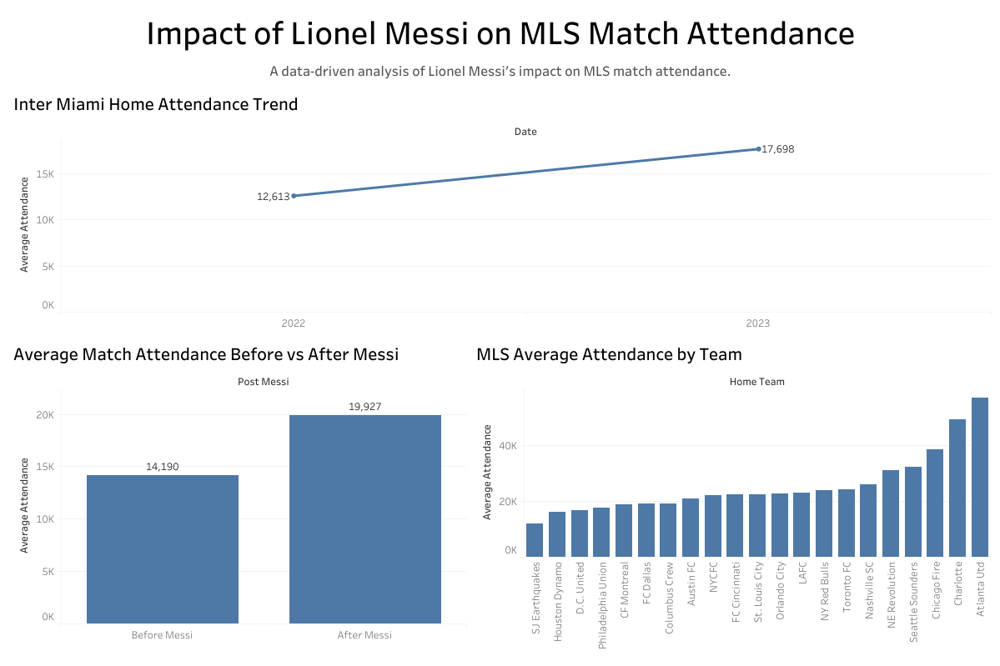

# MLS Messi Attendance Analysis

## Project Overview
This project analyzes the impact of Lionel Messi’s arrival at Inter Miami on Major League Soccer (MLS) match attendance.  
Using MLS match data from the 2022 and 2023 seasons, the analysis examines whether the presence of Messi significantly influenced stadium attendance across the league.

The project combines sports analytics with data science methods to explore how superstar players can affect fan engagement and league demand.

---

## Objectives
- Measure changes in MLS attendance before and after Messi joined Inter Miami
- Identify whether matches involving Inter Miami experienced higher attendance
- Explore how star athletes influence sports market demand

---

## Dataset
The dataset contains MLS match-level information including:

- Match date
- Season
- Home team
- Away team
- Match attendance

Data Source:  
MLS match records compiled from publicly available match reports.

---

## Tools & Technologies
This project uses the following tools:

- **Python**
- **Pandas** (data cleaning and preparation)
- **Statsmodels** (regression analysis)
- **Jupyter Notebook**
- **Tableau** (data visualization)

---

## Methodology

### 1. Data Cleaning
The raw MLS match data was cleaned and structured using Python and Pandas.

### 2. Feature Engineering
Key variables were created, including:

- **Post_Messi** – indicator for matches after Messi joined MLS
- **Miami_Home** – identifies Inter Miami home games
- **Interaction variable** – measures Messi-related attendance effects

### 3. Statistical Analysis
A regression model was used to evaluate the relationship between Messi’s arrival and match attendance.

Example regression model:

Attendance = β0 + β1(Post_Messi) + β2(Miami_Home) + β3(Post_Messi × Miami_Home) + ε

## Key Visualization

The figure above compares average attendance at Inter Miami home matches before and after Lionel Messi joined the club. The visualization highlights a clear increase in match attendance following Messi’s arrival, demonstrating the strong demand impact of superstar athletes in professional sports leagues.

## Tableau Dashboard

View the interactive Tableau dashboard here:

https://public.tableau.com/app/profile/bumjin.park/viz/ImpactofLionelMessionMLSMatchAttendance/InterMiamiHomeAttendanceBeforevsAfterLionelMessi

---

## Key Questions
This analysis explores several important sports business questions:

- Do superstar athletes increase league-wide attendance?
- Are attendance increases concentrated around a specific team?
- How strong is the economic impact of star players in sports leagues?

---

## Key Business Insight

The analysis suggests that Lionel Messi's arrival had a measurable impact on attendance at Inter Miami home matches.

Average attendance increased significantly after Messi joined the team, indicating a strong demand response from fans. This result supports the idea that superstar athletes can generate substantial economic value in professional sports leagues.

Higher attendance can translate into increased ticket revenue, stronger sponsorship opportunities, and greater media attention. For sports organizations, the presence of globally recognized athletes can significantly enhance both fan engagement and commercial performance.
